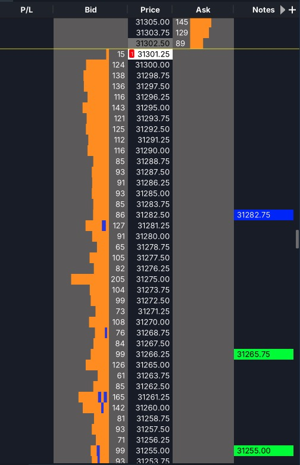

# Chart Lines in DOM for MotiveWave

**English** | [Русский](README.ru.md)

[](LICENSE)


[MotiveWave](https://www.motivewave.com) cannot show the lines you draw on a chart in the **DOM** (the price ladder). This indicator does:
every **horizontal line** on the chart becomes a **coloured note at the same price** in the DOM, in the colour of the line, and follows the line while you move, add or delete it.

You draw your levels once, on the chart, and see them while you trade from the ladder.



> **Display only.** A plain MotiveWave *Study*. It has no access to orders: it **cannot place, change or cancel an order**. It only reads the chart and writes DOM notes.

## What you get

| On the chart | In the DOM |
|---|---|
| a horizontal line at 31255.00, green | a green cell "31255.00" in the **Notes** column at that row |
| you drag the line to 31267.50 | the cell moves to 31267.50 |
| you delete the line | the cell disappears |
| you change the line's colour | the cell changes colour |
| two lines on one price | one cell (the first line's colour) |

With *Ticks/Row* above 1 the note is shown on the DOM row that contains the price. Lines you already have appear within a second of adding the indicator.

## Install

1. Download `DomLines.jar` from the [latest release](../../releases/latest).
2. Put it into the **`MotiveWave Extensions`** folder in your user home folder (MotiveWave scans it automatically; on macOS: `~/MotiveWave Extensions` — create the folder if it does not exist).
3. Restart MotiveWave (or wait ~10 seconds: it also picks up a new jar by itself). The indicator appears under **Study → Alex Indicators → Chart Lines in DOM**.

> Tested on **macOS with MotiveWave 7.1.1** and CME futures (MNQ). The jar is plain Java and should work on Windows too, but that has not been tested.

## Set up (once)

1. Open the chart whose lines you want, then **Study → Alex Indicators → Chart Lines in DOM → Add** (once per chart). Save the chart as a *Template* to get it on every new chart.
2. In the DOM header press **+** and tick **Notes**. The Notes column is **off by default** — this is the step people miss. Drag the **Notes** header next to **Price** (or widen the DOM) so the notes are close to the ladder.
3. The DOM must be **linked to the chart** (same instrument, same link colour). A DOM that is not linked never shows the chart's notes.

That is all.

## Settings

Click the **gear icon** next to *Chart Lines in DOM* in the chart legend for the three settings below (or Study → *Chart Lines in DOM* → Properties):

| Setting | Default | Meaning |
|---|---|---|
| Show chart lines in the DOM | on | Switch everything off without removing the indicator (the notes are cleared). |
| Show the price in the note | on | The price as the note's text. Off = just a coloured cell. |
| Use the colour of each line | on | Off = one fixed **Note colour** for all lines. |

## Limitations

- Only **horizontal** lines (two anchor points on one price). Sloped trend lines, vertical lines, rays with a slope, Fibonacci levels and other drawings are not mirrored.
- Lines you **hide** on the chart are still shown in the DOM (the platform's hide flag is not read yet).
- The chart's drawings are read through **MotiveWave's internals**, because the SDK has no API for them. Tested on **MotiveWave 7.1.1**. After a platform update the indicator may stop finding the lines; it then does nothing (it never breaks the DOM or the chart) and writes the reason to the log. Everything on the DOM side uses the public SDK.
- The notes belong to the chart. If the DOM is linked to a different chart or instrument, they are not shown there.

## Troubleshooting

| Symptom | What to check |
|---|---|
| No notes at all | Is the **Notes** column ticked in the DOM header **+** menu? Is the DOM linked to the chart? Is the indicator added to *this* chart? |
| Notes are there but far from the ladder | Drag the **Notes** header next to **Price**, or scroll the DOM; the notes only show on rows that are visible. |
| It worked before a MotiveWave update | Read the log (below). The platform's internals may have changed — open an issue with the MotiveWave version and the log line. |
| A line is missing | Only horizontal lines are supported; the line must have both anchors on the same price. |

Log: `~/Library/MotiveWave/DomLines/audit-<date>.log` (one short line per change, e.g. `16 line(s) on the chart …`, `notes +16`).

## How it works

The DOM can show *notes*, and the SDK lets a study add them (`DataContext.addNote`). What the SDK does not give is the list of the chart's drawings, so the indicator finds them by reflection (by the *shape* of the data, not by obfuscated names) and polls them every 300 ms. Full write-up with the evidence and the design: [docs/ARCHITECTURE.md](docs/ARCHITECTURE.md).

## Build from source

```bash
bash build.sh            # build + 21 tests -> build/DomLines.jar
bash build.sh install    # also copies it into ~/MotiveWave Extensions (hot-loaded, no restart)
```

Needs a JDK 17+ and, from your own MotiveWave installation, `mwave_sdk.jar` and the `javafx.*.jar` files (neither is part of this repository). Override the locations with `MW_SDK`, `MW_EXT`, `JAVA_HOME`.

## Changelog

**0.1.2** — fix: lines put down with one click (the horizontal-line hotkey) were not shown in the DOM; only lines stretched by mouse were. Now every horizontal line is mirrored.

**0.1.1** — the three settings are also behind the **gear icon** in the chart legend; the indicator now lives in the menu folder **Study → Alex Indicators** (was *General*).

**0.1.0** — first release: horizontal chart lines → DOM notes (price, line colour), live follow on move/add/delete, settings, log, 21 tests.

## License

[MIT](LICENSE). Not affiliated with MotiveWave. Use at your own risk; this is a display tool and not trading advice.
